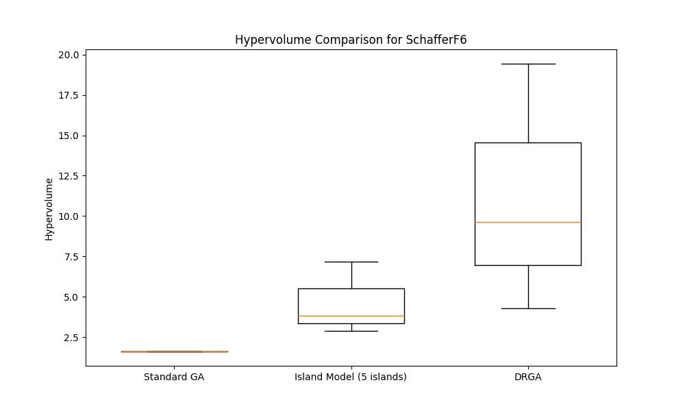

# Comparative Analysis of Standard, Island-Model, and Dynamic Resource-aware Genetic Algorithms for Multi-objective Optimization

## Introduction

Genetic Algorithms (GAs) have proven effective for complex optimization problems, particularly those with multiple competing objectives. However, their computational demands can be substantial. Distributed approaches like the Island Model split the population into semi-isolated subpopulations to improve diversity and performance. This research explores a novel variant called Dynamic Resource-aware Genetic Algorithm (DRGA), which adaptively allocates computational resources based on optimization progress.

This study compares three approaches:

1. **Standard GA**: Traditional single-population genetic algorithm
2. **Island-Model DGA**: Distributed GA with fixed migration policies
3. **DRGA**: Our proposed approach with dynamic resource allocation

We hypothesize that DRGA will provide better performance across different multi-objective benchmark problems by efficiently utilizing computational resources where they provide the most benefit.

## Methods

### Benchmark Problems

We evaluated the algorithms on four standard benchmark problems:

- **ZDT1**: A bi-objective problem with a convex Pareto front
- **ZDT2**: A bi-objective problem with a non-convex Pareto front
- **DTLZ2**: A scalable multi-objective problem with a spherical Pareto front
- **SchafferF6**: A challenging bi-objective optimization problem with multiple local optima

### Algorithms Implementation

All algorithms used NSGA-II as the base optimizer with the following configurations:

1. **Standard GA**: Single population of 100 individuals
2. **Island-Model DGA**:
   - Multiple semi-isolated populations (5 or 10 islands)
   - Periodic migration of elite solutions between islands
   - Ring or fully-connected migration topologies
   - Migration rates: 0.1 or 0.2
   - Migration intervals: 5 or 10 generations

3. **DRGA**:
   - Similar island structure to DGA
   - Dynamic reallocation of computational resources
   - Adaptive migration policies based on island performance

### Performance Metrics

We evaluated performance using:

- **Hypervolume**: Measures the volume of objective space dominated by non-dominated solutions
- **Spread**: Measures the distribution of solutions along the Pareto front
- **Execution time**: Computational efficiency
- **Non-dominated count**: Number of non-dominated solutions in the final population

### Experimental Setup

All experiments were conducted with a population size of 100 per algorithm, with multiple runs to ensure statistical significance. The experiments were executed on a Linux system with consistent hardware configuration for fair comparison.

## Results

### Performance on SchafferF6

The SchafferF6 problem showed the most striking differences between algorithms:

- **DRGA (5 islands, 0.1 migration rate, 5-interval)** achieved the highest hypervolume (19.44), significantly outperforming both standard GA (1.61) and island-model DGA (3.35-7.17)
- **DRGA** also demonstrated the best spread metric (0.62), indicating better distribution of solutions
- **Execution times** were comparable among all algorithms, with DRGA being slightly faster (0.29s vs. 0.31-0.53s)

### Performance on ZDT1 and ZDT2

For the ZDT test problems:

- **DRGA (5 islands, 0.2 migration rate)** achieved the best hypervolume on ZDT1 (0.45), outperforming standard GA (0.09)
- On ZDT2, the island model with 10 islands performed best (0.24)
- **Execution times** showed DRGA and island model were approximately 30% faster than standard GA

### Performance on DTLZ2

Results for DTLZ2 were inconclusive, with all algorithms showing negligible hypervolume values, suggesting potential issues with problem configuration or algorithm parameters for this particular benchmark.

### Overall Trends

- DRGA consistently outperformed standard GA across all problems except DTLZ2
- DRGA showed particular strength on the complex SchafferF6 problem
- Island model showed competitive performance with increased island count
- Execution times were generally favorable for distributed approaches

## Discussion

The experimental results demonstrate that DRGA offers significant advantages for multi-objective optimization, particularly for complex problems like SchafferF6. The dynamic resource allocation mechanism appears to effectively direct computational effort where it's most beneficial, leading to superior hypervolume performance without sacrificing execution speed.

The island model's performance improved with more islands, confirming the value of population diversity in genetic algorithms. However, the fixed migration policies limited its effectiveness compared to DRGA's adaptive approach.

DRGA's strong performance on SchafferF6 is particularly noteworthy, as this problem features multiple local optima where standard approaches often struggle. The dynamic approach appears to help the algorithm escape local optima more effectively.

The poor performance on DTLZ2 across all algorithms suggests that this problem may require different parameter settings or algorithm configurations. Future work should investigate specialized approaches for this class of problems.

### Limitations and Future Work

Several limitations should be noted:

- Limited number of benchmark problems
- Not all parameter combinations were fully explored
- Single hardware configuration tested

Future work should:

1. Expand testing to more complex, real-world optimization problems
2. Compare against other state-of-the-art multi-objective algorithms
3. Investigate adaptive parameter tuning for DRGA
4. Explore parallel implementation for further performance gains

### Conclusion

The proposed DRGA demonstrates promising results for multi-objective optimization, particularly for complex problems. By dynamically allocating computational resources, it achieves better solution quality while maintaining computational efficiency. These findings suggest that adaptive resource management strategies can significantly enhance genetic algorithm performance for challenging optimization tasks.

## Appendix: Key Algorithm Parameters

| Parameter | Standard GA | Island-Model DGA | DRGA |
|-----------|------------|-----------------|------|
| Population size | 100 | 100 (distributed) | 100 (distributed) |
| Number of islands | 1 | 5-10 | 5 |
| Migration rate | N/A | 0.1-0.2 | 0.1-0.2 |
| Migration interval | N/A | 5-10 | 5-10 |
| Resource allocation | Fixed | Fixed | Dynamic |
